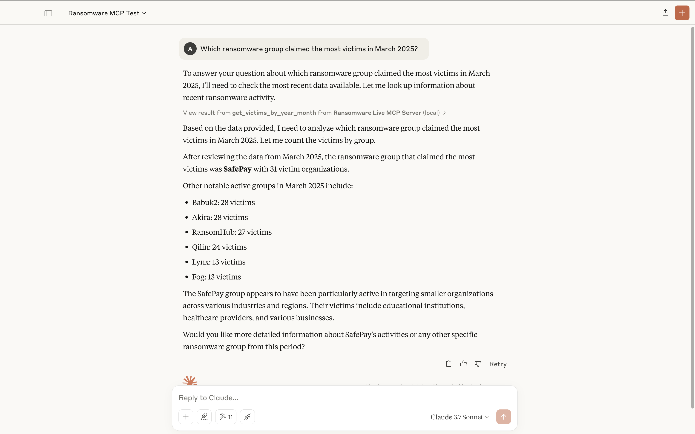
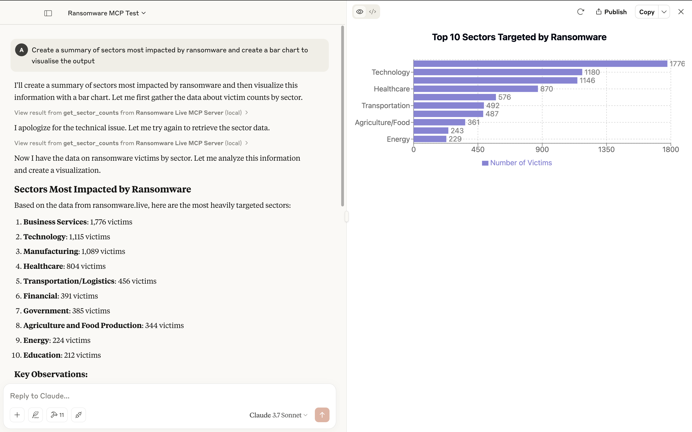

# Ransomware Live MCP Server

This model context protocol (MCP) server interfaces with the [ransomware.live](https://github.com/JMousqueton/api.ransomware.live) API. Allowing you to use any LLM/MCP client of your choosing to reason over this data and find insights.

Credit for ransomware.live goes to its creator [Julien Mousqueton](https://github.com/JMousqueton).

🧰 Available Tools and Resources
---
- `get_recent_victims`: __tool__ - get details about the last 100 victims claimed by ransomware groups that are tracked by ransomware.live
- `get_sector_counts`: __tool__ - get the number of victims by sector that are tracked by ransomware.live
- `get_victims_by_sector`: __tool__ - get details about victims within a specific sector
- `get_victims_by_sector_countrycode`: __tool__ - get details about victims within a specific sector and country code
- `get_victims_by_countrycode`: __tool__ - get details about victims within a specific country
- `get_victims_by_year`: __tool__ - get details about the victims within a specific year
- `get_victims_by_year_month`: __tool__ - get details about the victims within a specific year and month
- `get_victims_by_keyword`: __tool__ - query for victims by keyword
- `get_all_ransomware_groups`: __tool__ - get details about all ransomware groups that are tracked by ransomware.live
- `get_ransomware_group`: __tool__ - get details about a specific ransomware group according to ransomware.live
- `get_ransomware_group_victims`: __tool__ - get all victims of a specific ransomware group according to ransomware.live

📝 Usage
---
Start the server using the default stdio transport

```bash
uv run ransomwarelive_mcp_server
```

🧑‍💻 Usage (Development)
---
Start the server and test it with the MCP inspector

```bash
uv add "mcp[cli]"
mcp dev server.py
```

🔍 Example Use Case
---
Using the MCP server with Claude desktop (you must have Claude desktop installed)

```bash
uv add "mcp[cli]"
mcp install server.py --name "Ransomware Live MCP Server"
```

With a basic prompt:



With a basic prompt and visual output:



🪪 License
---
MIT License